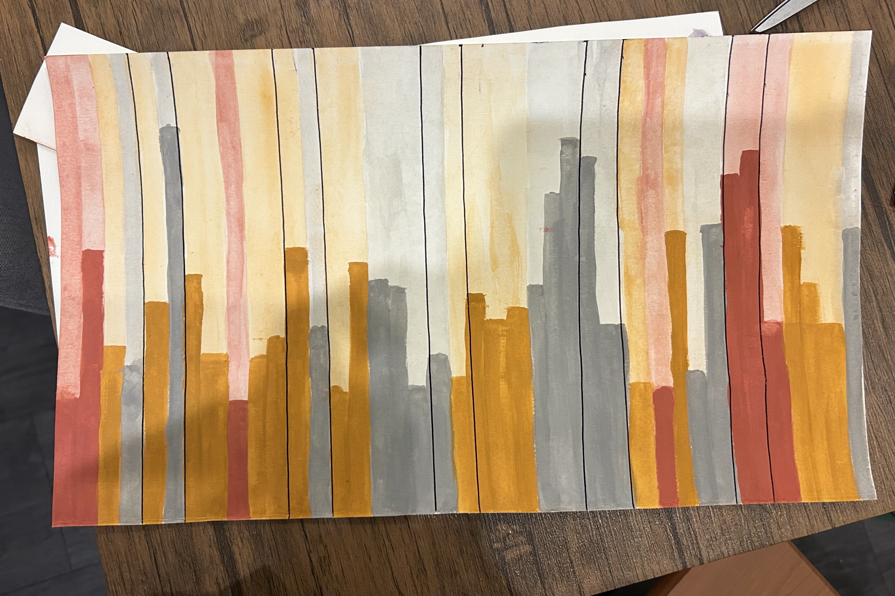

[Link to my Github repo](https://github.com/themilamatich/ENVS-193DS_spring-2026_final)

# Set Up 
```{r}
#| label: set-up-load-packages-read-in-data

# loading in packages for final 
library(tidyverse) # general use
library(janitor) # cleaning data frames
library(here) # file organization
library(rstatix) # calculate cohen's d
library(MuMIn) # model selection
library(DHARMa) # 
library(ggeffects) # getting model predictions

# reading in data and storing as objects 
nests <- read_csv(here("data","nest_data_final.csv"))
personal <- read_csv(here("data","personal_data.csv"))

# cleaning personal data for problem 3
personal_clean <- personal |> 
  # cleaning column names 
  clean_names() |> 
  # selecting columns of interest
  select(weekday_or_weekend,
         step_count)
```


# Problem 1: Research Writing 

## a. Transparent statistical methods

**In part 1, they used a generalized linear model (GLM)** to how distance to water edge predicts the probability of American Avocet microhabitat use. **In part 2, they used a chi-sqaured test** to compare counts between bird species across different habitat sites.

## b. Suggestions for rewriting

#### Part 1: 

Habitat distance to water edge was a significant predictor of whether or not the shorebird American Avocet used the microhabitat. 


#### Part 2: 

Our study shows that the distribution of bird species differed significantly across different habitat types (managed pond, non-tidal marsh, salt pond, tidal marsh, or tidal mudflat). These results suggests that the studies bird species (American Avocet, Forster’s Tern, Black-necked Stilt) use habitats differently, and may prefer some habitats more than others. 


## c. Further analysis

One additional variable that could influence the probability of American Avocet microhabitat use could be seasonality measured across a long time series and keeping track of date (categorical variable) that would be categorically placed into Fall, Spring, Summer or Fall. This factor would influence the habitat use as it influences shorebird migration patterns, which determines whether or not the birds are in the location of study.

# Problem 2: Data Analysis

## a. Clean and wrangle 

```{r}
#| label: cleaning-and-wrangling-data

# creating a new object called: nests_clean for cleaned data set 
nests_clean <- nests |> 
  # creating new columns to store full scientific species name 
  mutate(ant_species = case_match(
    ant_species,
    "AB" ~ "Crematogaster sjostedti", # C. sjostedti
    "RRB" ~ "Crematogaster mimosae", # C. mimosae
    "TP" ~ "Tetraponera penzigi", # T. penzigi
    "BBR" ~ "Crematogaster nigriceps", # C. nigriceps
  )) |>
  # filter to only include: C. mimosae, C. sjostedti, and C. nigriceps
  filter(ant_species %in% c("Crematogaster mimosae", 
                            "Crematogaster sjostedti", 
                            "Crematogaster   nigriceps")) |> 
  # reordering ant species levels according to instructions
  mutate(ant_species = as_factor(ant_species),
         ant_species = fct_relevel(ant_species,
                                       "Crematogaster sjostedti",
                                       "Crematogaster mimosae",
                                       "Crematogaster nigriceps")) |> 
  # selecting columns of interest for the research questions (only 3)
  select(height_cm, ant_species, case_control)

# display 10 random rows
slice_sample(nests_clean, n = 10)
  
```

## b. Response variable 

The 1s and the 0s in a biological context represents a binary outcome of presence (1) or not present (0). In this specific study, 1 represents a tree with a nest and 0 represents that there was an "available" tree for comparison (0). 

## c. Purpose of study 

One of the predictors is tree height, which is a numerical, continuous variable (measured in cm). As tree height increases, the probability of nest occurrence would increase as it would be further away from ground predators

The other predictor is acacia ant species, which is a categorical variable (differentiated by type of ant). ---

** need access to the article to answer**

## d. Table of models 

## e. Run the models 

## f. Select the best model 

## g. Check the diagnostics 

## h. Visualize the models predictions 

## i. Write a caption for your figure 

## j. Calculate model predictions 

## k. Interpret your results 

# Problem 3. Affective and exploratory visualizations

## a. Comparing visualizations

- My affective visualizations differ greatly from my exploratory visualization in Homework 2 as it represents my data in a different way. Instead of using a linear model or a box plot, I use a bar graph diagram in order to show my step count on each given day. It also shows how my data fluctuates through time as each bar represents one day, while the visualizations in homework 2 do not differentiate each day on a linear time scale (they are just represented by points). Additionally, instead of continuing to explore temperature as a predictor variable, I chose to do amount of homework as I felt like it would be easiest to visualize. 

- They are similar in that both visualizations show each individual data point, where this is through points in both of my graphs from Homework 2, and done by bars in my affective visualization. 

- Some patterns that I see is that step count was higher visually on weekends compared to weekdays (as shown by the median bar on the boxplot and the hieght of the outlined bars in my affective visualization). Additionally, like how temperature affected my step count, there seems to not be a pattern in homework levels and step count. 

- I got a lot of feedback for my color scheme and also for my artist statement. I was told that my color scheme was misleading because while brown represented the "medium" amount of homework, it stood at the most and should have represented the "high" amount of homework, and that I should stick to a classic high, medium, low color scheme with red purple and blue, or keep it monochromatic with different shades. That being said, I changed my colors to be gray, yellow, and red to show low, medium, high as it makes more sense visually and intuitively. I also got feedback on my artist statement to include more information about what my piece is showing and why, which I ended up including. 

## b. Designing an analysis

The main question that I was asking, regardless of the other variables I measured, was how my step count differed between the days that I had class and days that I did not (ie. weekday vs. weekend). That being said, my predictor variable would be day of the week, as a binary, categorical variable (weekday vs. weekend) and my response variable would be step count, which is a discrete numerical variable. 

An analysis I could run to answer this question would be Two-Sample T-test (Student's if variances are equal and data is normally distributed, Welche's if variances are not equal but data is normally distributed, and Mann Whitney U if data are not normally distributed), however the specific type of test depends on whether my data is normal and variances are equal. This test makes sense as it will compare my average (or median) step count across the weekdays and the weekends, which is two groups of data. It also make sense because my predictor variable is categorical, and I want to compare step count across two groups and see how they differ. 

## c. Check any assumptions and run your analysis

### Checking Assumptions 

#### Normality 
```{r}
#| label: checking-for-normality-QQPlot
  
# base layer: gg-plot
ggplot(data = personal_clean, # using cleaned personal data frame
       # y-axis is step count
       mapping = aes(sample = step_count)) +
  # first layer: QQ reference line
  geom_qq_line(color = "#6B8FA3") + # coloring the line
  # second layer: adding qq points
  geom_qq() +
  # creating new panels for each treatment type
  facet_wrap(~ weekday_or_weekend)
```
Data points on both Weekday and Weekend QQ plots roughly follow the reference line, besides a bit of deviation on the tails. Thus, it can be concluded that the data for weekend and weekday are normally distributed and the assumption of normality is met. 

#### Vairances 

```{r}
#| label: checking-variances 

# checking variances using var.test
var.test(
  # formula: response variable ~ grouping variable
  step_count ~ weekday_or_weekend, 
  # data from cleaned data set 
  data = personal_clean
)
```
We determined that group variances are equal (F-test, F(28, 11) = 0.521 p = 0.17). 

### Running Analysis 

#### Student's T-Test 
```{r}
#| label: running-a-t-test

# running a Student's t-test using results from normality & variance test 
t.test(
  # formula: response variable ~ grouping variable
  step_count ~ weekday_or_weekend, 
  # adding the argument for equal variances
  var.equal = TRUE,
  # using data from cleaned personal data frame
  data = personal_clean
)
```

#### Effect Size 
```{r}
#| label: caluclate-effect-size 

# calculating the effect size between step count and weekday/weekend
# formula: response variable ~ grouping variable
cohens_d(step_count ~ weekday_or_weekend,
         # pulling from personal clean data set
         data = personal_clean)
```

## d. Create a visualization

### Generating Summary for Jitter Plot
```{r}
#| label: summary-stats

# creating a new object called urchins_summary to calculate values
personal_summary <- personal_clean |>
  # group by weekday or weekend
  group_by(weekday_or_weekend) |>
  # calculating values for each category 
  summarize(mean = mean(step_count), # calculating mean
            n = length(step_count), # calculating sample size
            sd = sd(step_count)) # calculating standard deviation
```

### Generating Jitter Plot for T-Test 
```{r}
#| label: making-a-jitter 
# base layer: ggplot
ggplot(data = personal_clean,
       mapping = aes(x = weekday_or_weekend, # x-axis = weekday/weekend
                     y = step_count,# y-axis = step count
                     color = weekday_or_weekend)) + # assigning colors
  # first layer: adding underlying data (individual observations)
  geom_jitter(width = 0.1, # narrow jitter width
              height = 0, # no vertical jitter/point movement along the y-axis
              alpha = 0.5, # transparent points to be visually distinct
              shape = 21) + # open circle points
  # second layer: adding point for the mean
  geom_point(data = personal_summary, # data from summary
             mapping = aes(x = weekday_or_weekend, # x-axis = weekday/weekend
                           y = mean), # y-axis = mean value of steps
             size = 2) + # adjusting point size
  # third layer: adding error bars to show variation
  geom_errorbar(data = personal_summary, # data from summary
                mapping = aes(x = weekday_or_weekend, # x-axis = weekday/weekend
                              y = mean, # y-axis = mean
                              ymin = mean - sd, # min y-value on error bar
                              ymax = mean + sd), # max y-value on error bar
                width = 0.1) + # make bars narrower
  # selecting colors for each day category
  scale_color_manual(values =c("Weekday" = "#FFD166", # Weekday = yellow
                               "Weekend" = "dodgerblue")) + # Weekend = blue
  # labeling x and y axis
  labs(x = "Weekday or Weekend", # x labeled as "Weekday or Weekend"
       y = "Step Count") + # y labeled as "Step Count"
  # changing theme elements
  theme(text = element_text(family = "serif"), # font = serif
       panel.background = element_rect(fill = "white", # no panel background
                                      colour = "black", # black outline
                                      linewidth = 1), # width of outline
      panel.grid = element_blank(), # getting rid of gridlines
      axis.ticks = element_line(linewidth = 1), # adding tick marks on axes
      legend.position = "none") # getting rid of legend
```

## e. Write a caption 
**Figure 1. Number of steps taken differs on weekday versus weekend.** Small circular points represent the total number of steps recorded on a given weekday (yellow points) or weekend (blue points) from 2026-04-21 to 2026-05-30. The average step count is shown by the solid dot, while the error bars represent the standard deviation of the data to show the variability within the weekdays or weekends. Data collected by Mila Matich from 2026-04-21 to 2026-05-30.

## f. Write about your results 
My results suggest that my step count was greater on on Weekends (mean = 13,111.91 steps) than Weekdays (mean = 9506.83 steps). I found a large (Cohen's d = -0.927) effect of day-type on mean step count between the weekdays (n = 29) and weekends (n = 11) (Student's t-test, t(38) = -2.8381, p = 0.007245, $\alpha$ = 0.05). 

## g. Sharing your affective visualization 


